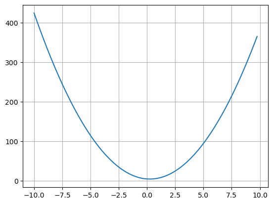
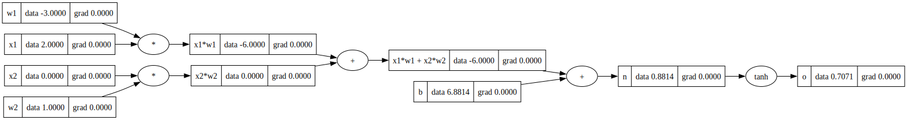
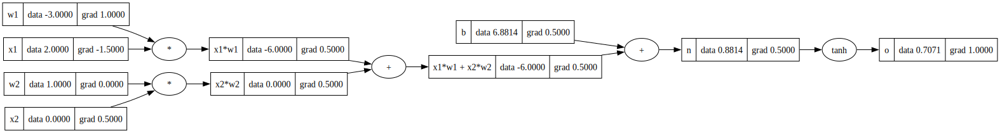

# BackPropAgora
 Understanding and Implementing Backprop Algorithm from scratch

### The repository contains the following files (as of now):-<br>
- [gradients.ipynb](gradients.ipynb)
- [manual_Approach.ipynb](manual_Approach.ipynb)
- [functional_Approach.ipynb](functional_Approach.ipynb)


## `gradients.ipynb`

This notebook discusses the basic mathematical approach of finding `gradients` of any feature variable w.r.t the output function

- Took a simple quadratic function
```python
def f(x):
    return 4*x**2 - 2*x + 5
```
<br>

- Plotted with `matplotlib.pyplot`
```python
x = np.arange(-10, 10, 0.25)
y = f(x)
plt.plot(x,y)
plt.grid()
```

<br>

- Computed the `derivative` a.k.a `gradient` : `dy/dx` using the below expression

$$L = \lim_{h\to 0} \frac{f(a + h) - f(a)}{h}$$


```python
h = 0.001
x = 3.0

print((f(x+h)-f(x))/h) # 22.00399999999547
```

- Another Example
```python
h = 0.0001

a = 2.0
b = -3.0
c = 10.0
d1 = a*b + c
c+=h
d2 = a*b + c

print('d1', d1)                 # 4.0
print('d2', d2)                 # 4.0001
print('d(d1)/d(c)', (d2-d1)/h)  # d(d1)/d(c) 0.9999999999976694
```
<br>
<br>


## `manual_Approach.ipynb`

This notebook serves the following purposes:<br>
- implements a `Value` data structure for storing the info about each `feature/variable`:

    ```python
    class Value:
        def __init__(self, value, children = (), op = '', label = ""):
            self.value = value
            self.prev = set(children)
            self.op = op
            self.label = label
            self.grad = 0.0

        def __repr__(self) -> str:
            return (f"(Value = {self.value})")
        
        def __add__ (self, other):
            out = Value(self.value + other.value, children=(self, other), op='+')
            return out
        
        def __mul__ (self, other):
            out = Value(self.value * other.value, children=(self, other), op='*')
            return out
        
        def tanh(self):
            x = self.value
            t = ((math.exp(2*x) - 1)/(math.exp(2*x) + 1))
            out = Value(t, (self, ), 'tanh')
            return out
    ```    
    - data attributes:

        - `value` : the float value of the node
        - `prev` : set of `Value` objects a.k.a nodes which are related to the current `Value` node
        - `op` : operation i.e `+`, `*`, `tanh`
        - `label` : so as to give a label to the `Value` node for visualization purpose

    - functions:
        - `__add__()`: addition between `Value` objects
        - `__mul__()`: multiplication between `Value` objects
        - `tanh()`: hyperbolic tangent for `Value` object 
        - `__repr__()`: to define the string representation of the `Value` object for logging purposes

- visualizes the representations of the computations involved in a neural network or any other mathematical expression by creating a `DAG: Directed Acyclic Graph` using `graphviz` library

    ```python
    from graphviz import Digraph
    def trace(root):
        nodes, edges = set(), set()
        def build(v):
            if v not in nodes:
                nodes.add(v)
                for child in v.prev:
                    edges.add((child, v))
                    build(child)
        build(root)
        return nodes, edges

    def draw(root):
        dot = Digraph(format='svg', graph_attr = {'rankdir': 'LR'})

        nodes, edges = trace(root)
        for n in nodes:
            uid = str(id(n))
            dot.node(name = uid, label = '{%s|data %.4f|grad %.4f}'%(n.label,n.value, n.grad), shape='record')
            if n.op:
                dot.node(name = uid + n.op, label = n.op)
                dot.edge(uid+n.op , uid)
            
        for n1, n2 in edges:
            dot.edge(str(id(n1)), str(id(n2)) + n2.op)

        return dot
    ```

    - Here's a brief breakdown of the code:

        - The `trace` function takes a root node (which is a `Value` object) and recursively traverses the computational graph, building sets of nodes (`nodes`) and edges (`edges`) that represent the graph structure.

        - The `build` function is a helper function used by `trace` to recursively add nodes and edges to the respective sets.

        - The `draw` function takes the root node and creates a `Digraph` object from the `graphviz` library. It then uses the `nodes` and `edges` sets obtained from the `trace` function to create a visual representation of the computational graph.
            - For each node in the graph, it creates a graphviz node with a custom label that displays the node's label, value, and gradient.
            - For each `op` operation `(e.g., +, *, tanh)`, it creates an intermediate node with the operation symbol as the label.
            - It connects the nodes with edges based on the `edges` set obtained from `trace`.

<br>
<br>

# Examples
- A simple expression initialization using `Value` data structure


    ```python
    # inputs 
    x1 = Value(2.0, label='x1')
    x2 = Value(0.0, label='x2')

    # weights
    w1 = Value(-3.0, label='w1')
    w2 = Value(1.0, label='w2')

    # bias
    b = Value(6.8813735870195432, label='b')

    # x1*w1 + x2*w2 + b
    x1w1 = x1*w1; x1w1.label = 'x1*w1'
    x2w2 = x2*w2; x2w2.label = 'x2*w2'
    x1w1x2w2 = x1w1 + x2w2; x1w1x2w2.label='x1*w1 + x2*w2'
    n = x1w1x2w2 + b; n.label = 'n'
    o = n.tanh(); o.label = 'o'
    ```

- Visualizing the expression
    ```python
    ## visualizing using the draw function created above using graphviz library

    draw(o)
    ```

    

- Calculating the gradients _manually_ & _mathematically_

    ```python
    o.grad = 1.0
    # n.grad = 1 - (o.value)**2  #0.499999999
    n.grad = 0.5

    n_x1w1x2w2, n_b = 1.0, 1.0
    x1w1x2w2.grad = n.grad * n_x1w1x2w2
    b.grad = n.grad * n_b

    x1w1x2w2_x1w1, x1w1x2w2_x2w2 = 1.0, 1.0
    x1w1.grad = n.grad * n_x1w1x2w2 * x1w1x2w2_x1w1
    x2w2.grad = n.grad * n_x1w1x2w2 * x1w1x2w2_x2w2

    x1w1_x1, x1w1_w1 = w1.value, x1.value
    w1.grad = n.grad * n_x1w1x2w2 * x1w1x2w2_x1w1 * x1w1_w1
    x1.grad = n.grad * n_x1w1x2w2 * x1w1x2w2_x1w1 * x1w1_x1

    x2w2_x2, x2w2_w2 = w2.value, x2.value
    w2.grad = n.grad * n_x1w1x2w2 * x1w1x2w2_x2w2 * x2w2_w2
    x2.grad = n.grad * n_x1w1x2w2 * x1w1x2w2_x2w2 * x2w2_x2

    # Refresh the above cell i.e draw(o) to update gradients in the graph created !!
    ```

- Updated Graph

    


<br>
<br>


## `functional_Approach.ipynb`

will write about this notebook afterwards..feeling sleepy rightnow...gotta sleep now 💤


